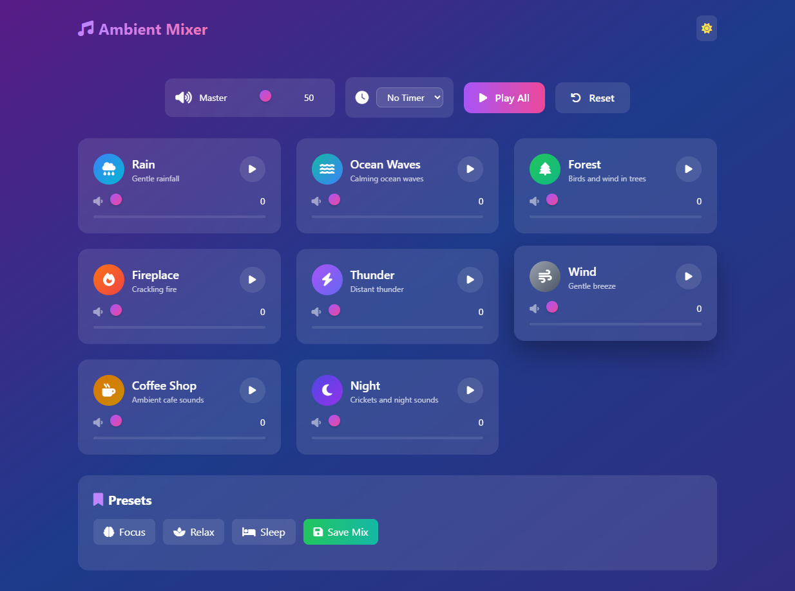
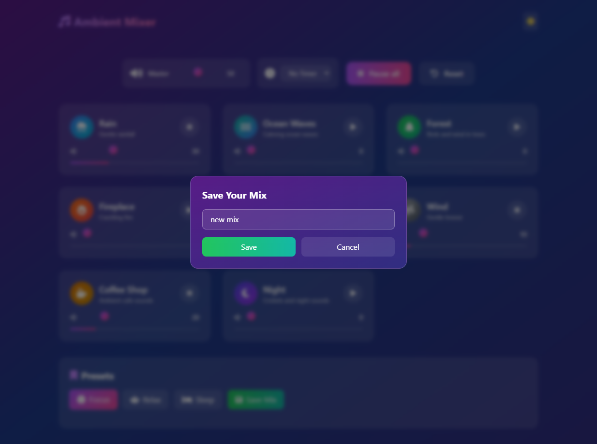

# Ambient Sound Mixer

A lightweight ambient sound generator built with plain HTML, CSS, and JavaScript. It lets you mix multiple looping soundscapes such as rain, ocean waves, forest ambience, crackling fire, thunder, wind, cafe ambience, and night sounds into a calming personal atmosphere.

## Preview





## Features

- Multiple ambient sound layers with independent volume controls
- Master volume control for overall output balance
- Play/Pause controls for each sound and for all sounds together
- Preset mixes such as Focus, Relax, and Sleep
- Custom preset saving via localStorage
- Timer support for automatic shutdown after a selected duration
- Light/Dark theme toggle
- Responsive layout for desktop and smaller screens

## Tech Stack

- HTML5
- CSS3
- Tailwind CSS via CDN
- JavaScript (ES modules)
- Web Audio API through HTMLAudioElement looping playback

## Project Structure

```text
Ambient Sound Mixer/
├── index.html
├── css/
│   └── styles.css
├── js/
│   ├── app.js
│   ├── presetManager.js
│   ├── soundData.js
│   ├── soundManager.js
│   ├── timer.js
│   └── ui.js
├── audio/
│   ├── rain.mp3
│   ├── ocean.mp3
│   ├── forest.mp3
│   ├── fireplace.mp3
│   ├── thunder.mp3
│   ├── wind.mp3
│   ├── cafe.mp3
│   └── night.mp3
├── img/
│   ├── img1.png
│   └── img2.png
└── README.md
```


## Main App Logic

- `js/app.js` initializes the app and wires up all UI actions
- `js/soundData.js` contains the sound definitions and default preset mixes
- `js/soundManager.js` handles audio loading, playback, and volume control
- `js/ui.js` updates the DOM for cards, presets, theme, and modal states
- `js/presetManager.js` manages custom presets in browser storage
- `js/timer.js` runs the countdown timer logic

## Usage

1. Open the app in the browser.
2. Use the sound cards to enable and adjust individual ambience layers.
3. Adjust the master volume slider for the overall mix.
4. Select one of the preset buttons or save your own custom mix.
5. Use the timer to stop all sounds after a set period.

## Notes

This project is designed as a simple, dependency-light ambient mixer for learning and personal use. It is intentionally built with vanilla JavaScript instead of a framework to keep the app fast to open, easy to understand, and easy to customize.

